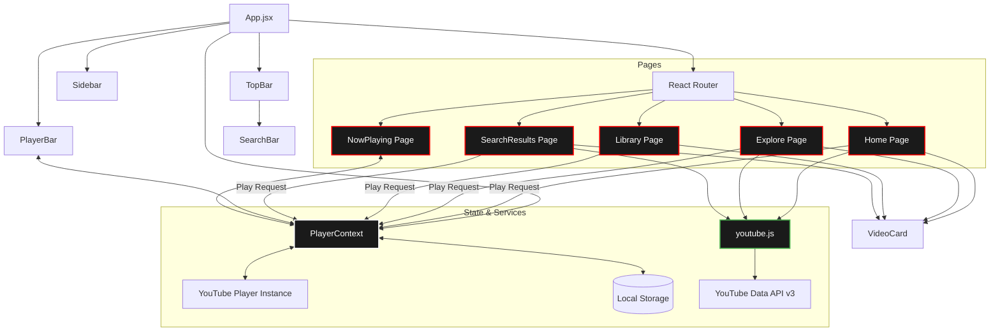
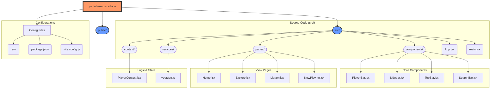

# YouTube Music Clone

A modern, responsive web application that replicates the core functionality and design of YouTube Music. Built with React, Vite, and the YouTube Data API.

## Features

### 🎵 **Core Music Player**

- **YouTube Integration**: Full YouTube video playback using react-youtube
- **Playback Controls**: Play/pause, next/previous, volume control
- **Queue Management**: Add songs to queue, clear queue, play next
- **Repeat & Shuffle**: Toggle repeat (off/one/all) and shuffle modes
- **Progress Tracking**: Real-time progress bar with seek functionality

### 🎨 **User Interface**

- **Dark Theme**: YouTube Music-inspired dark color scheme
  
- **Responsive Design**: Works seamlessly on desktop, tablet, and mobile
- **Smooth Animations**: Hover effects, transitions, and loading states
- **Modern Layout**: Sidebar navigation, top bar, and persistent player bar

### 📱 **Navigation & Pages**

- **Home**: Trending music, recommendations, recently played
- **Explore**: Browse by mood, featured playlists, trending songs
- **Library**: Saved songs, playlists, recently played tracks
- **Search**: Real-time search with YouTube API integration
- **Now Playing**: Full-screen player with related songs

### 💾 **Data Persistence**

- **Local Storage**: Saves liked songs, playlists, recently played
- **Queue Persistence**: Maintains playback queue across sessions
- **User Preferences**: Volume, repeat mode, shuffle settings

### 🎯 **Advanced Features**

- **Smart Queue**: Automatic next song playback with repeat modes
- **Like System**: Heart-based song liking with visual feedback
- **Playlist Creation**: Create and manage custom playlists
- **Mood-Based Browsing**: Explore music by mood categories
- **Related Content**: Suggested songs based on current playback

## Tech Stack

### Frontend

- **React 18** - Modern component-based UI framework
- **Vite** - Fast build tool and development server
- **React Router** - Client-side routing
- **React Icons** - Icon library for UI elements

### Styling

- **CSS3** - Custom styles with CSS variables
- **Flexbox & Grid** - Modern layout techniques
- **Media Queries** - Responsive design
- **CSS Animations** - Smooth transitions and effects

### External APIs

- **YouTube Data API v3** - Video search and trending data
- **YouTube IFrame Player API** - Embedded video playback

### Development Tools

- **ESLint** - Code linting and formatting
- **Node.js** - Runtime environment

## Installation

### Prerequisites

- Node.js (version 16 or higher)
- YouTube Data API key

### Setup Instructions

1. **Clone the repository:**

   ```bash
   git clone https://github.com/your-username/youtube-music-clone.git
   cd youtube-music-clone
   ```

2. **Install dependencies:**

   ```bash
   npm install
   ```

3. **Set up environment variables:**
   Create a `.env` file in the root directory:
   VITE_YOUTUBE_API_KEY=your_youtube_api_key_here

4. **Get YouTube API Key:**
   - Go to [Google Cloud Console](https://console.cloud.google.com/)
   - Create a new project or select existing one
   - Enable YouTube Data API v3
   - Create API credentials (API key)
   - Add your domain to the allowed referrers for security

5. **Run the development server:**

   ```bash
   npm run dev
   ```

6. **Open your browser:**
   Navigate to `http://localhost:5173`

## Project Architecture



## Project Structure



### Folder Breakdown

| Directory | Purpose |
| :--- | :--- |
| **`public/`** | Static assets, icons, and public manifest files. |
| **`src/components/`** | Reusable UI elements (Player, Sidebar, SearchBar, etc.). |
| **`src/pages/`** | Main view components representing different routes. |
| **`src/context/`** | Global state management via React Context API. |
| **`src/services/`** | External API integration and utility functions. |
| **`src/assets/`** | Local images, fonts, and style-specific assets. |

## Usage

### Basic Navigation

1. **Home**: Browse trending and recommended music
2. **Explore**: Discover music by mood and genre
3. **Library**: Access your saved songs and playlists
4. **Search**: Find specific songs, artists, or albums

### Music Playback

1. **Play Music**: Click any video card to start playback
2. **Player Controls**: Use the persistent player bar at the bottom
3. **Queue Management**: Add songs to queue using the + button
4. **Playback Options**: Toggle repeat and shuffle modes

### Personalization

1. **Like Songs**: Click the heart icon to save favorite tracks
2. **Create Playlists**: Use the library page to create custom playlists
3. **Recent Activity**: Automatically tracks recently played songs

## Browser Support

- Chrome (latest)
- Firefox (latest)
- Safari (latest)
- Edge (latest)

## API Rate Limits

The YouTube Data API has rate limits:

- **Free tier**: 10,000 requests per day
- **Search requests**: 100 units per request
- **Video details**: 1 unit per request

The application includes caching and efficient API usage to minimize requests.

## Performance Features

- **Lazy Loading**: Components load as needed
- **Efficient Rendering**: Optimized React components
- **Caching**: Local storage for user data
- **Responsive Images**: Appropriate thumbnail sizes

## Contributing

1. Fork the repository
2. Create a feature branch (`git checkout -b feature/amazing-feature`)
3. Commit your changes (`git commit -m 'Add amazing feature'`)
4. Push to the branch (`git push origin feature/amazing-feature`)
5. Open a Pull Request

## License

This project is licensed under the MIT License - see the [LICENSE](LICENSE) file for details.

## Disclaimer

This is a fan-made clone for educational purposes. It is not affiliated with or endorsed by YouTube or Google. All trademarks and logos belong to their respective owners.

## Support

If you encounter issues:

1. Check the browser console for errors
2. Ensure your YouTube API key is valid
3. Verify CORS settings in Google Cloud Console
4. Open an issue on GitHub with detailed information

## Future Enhancements

- [ ] Lyrics display
- [ ] Audio visualizations
- [ ] Social features (sharing, following)
- [ ] Offline playback
- [ ] Podcast support
- [ ] Premium features simulation
- [ ] Advanced playlist management
- [ ] Music recommendations algorithm
